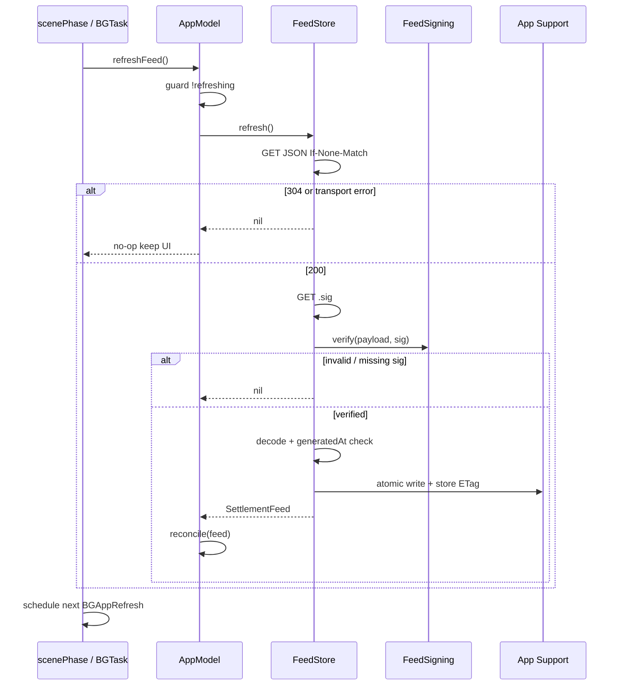
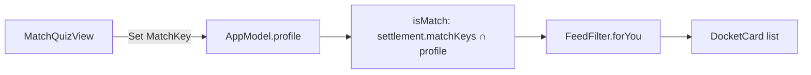
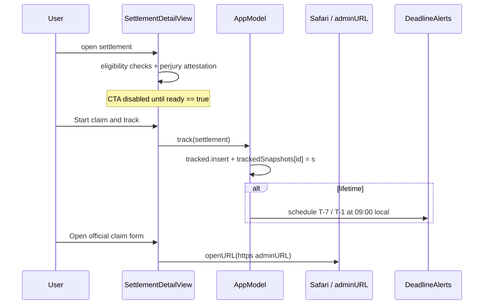
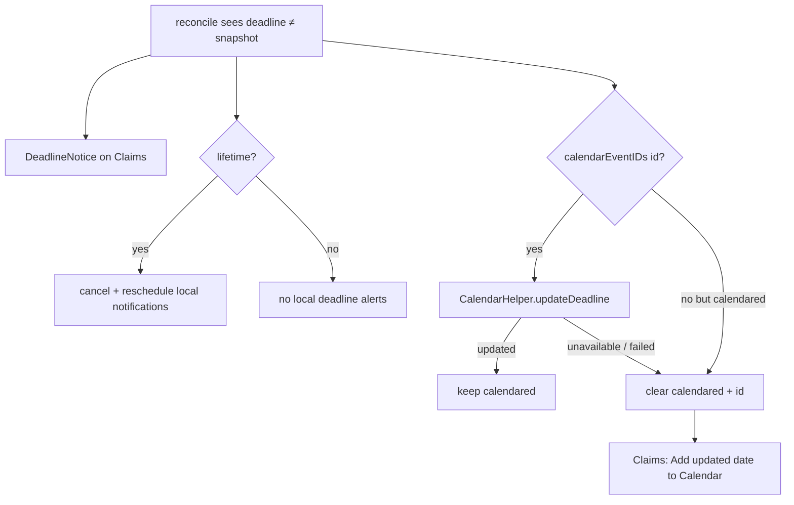
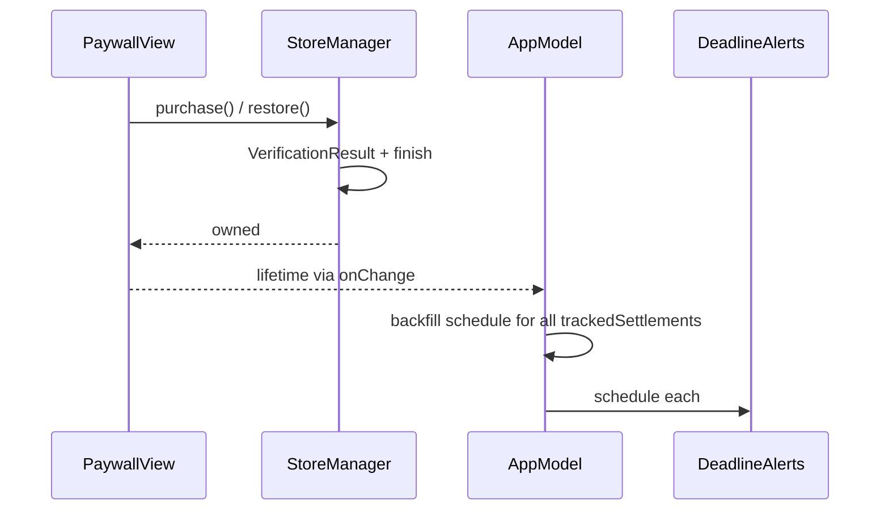

# Owed — Architecture & Runtime Data Flow

**Audience:** Apple platform engineers owning correctness of what users see and tap.  
**Companion:** [`BUILD.md`](BUILD.md) (ship gates), [`FEED_OPERATIONS.md`](FEED_OPERATIONS.md) (publish), [`../PIPELINE.md`](../PIPELINE.md) (upstream review).

---

## 1. Design thesis

Owed is a **document browser with a claim ledger**, not a social or transactional backend client.

- The **settlement list** is editorial content: versioned, signed, cached, reconciled.
- The **user’s answers and claims** are device-local state: never uploaded.
- The **only intentional egress of personal intent** is the user opening an HTTPS administrator form in Safari / `openURL`.

If you find yourself designing a session, account, or “sync my quiz to the server,” you are designing a different product.

---

## 2. Process & layer map

```
┌──────────────────────────────────────────────────────────────────┐
│ SwiftUI App process                                              │
│                                                                  │
│  OwedApp ──► RootView (TabView)                                  │
│     │              │                                             │
│     │              ├─ FindView ──────► SettlementDetailView      │
│     │              ├─ ClaimsView ────► SettlementDetailView      │
│     │              └─ AlertsView / PaywallView / MatchQuizView   │
│     │                         │                                  │
│     │              @Environment(AppModel)  @Environment(StoreManager)
│     │                         │                    │             │
│     ├─ scenePhase == .active ─┴─ refreshFeed()     │             │
│     ├─ BGAppRefreshTask ──────┘                    │             │
│     └─ StoreKit owned ─────────────────────────────┘             │
│                                                                  │
│  FeedStore ── URLSession(ephemeral) ──► CDN / GitHub raw         │
│       │              ▲                                           │
│       │              └── SettlementFeed.json + .json.sig         │
│       ▼                                                          │
│  FeedSigning (Ed25519, public key in bundle)                     │
│       ▼                                                          │
│  SettlementFeed.decode (strict envelope / lossy records)         │
│       ▼                                                          │
│  Application Support cache  │  Bundle SettlementFeed.json        │
│                                                                  │
│  Side effects (reconcile):                                       │
│    UNUserNotificationCenter · EventKit (write-only) · Spotlight  │
└──────────────────────────────────────────────────────────────────┘
```

**Ownership rules**

| Concern | Owner | Not owned by |
|---------|--------|--------------|
| Entitlement (lifetime) | `StoreManager` / StoreKit | `AppModel` (mirrors only) |
| Settlement catalog shown in Find | `AppModel.settlements` ← FeedStore | Views (read-only via environment) |
| Tracked claim truth | `tracked` + `trackedSnapshots` | Live feed alone |
| Match profile | `AppModel.profile` (UserDefaults) | Network |
| Feed bytes on disk | `FeedStore` cache | AppModel |
| Calendar event ids | `calendarEventIDs` | EventKit as source of truth under write-only |

---

## 3. End-to-end data flow (publisher → pixels)

```mermaid
flowchart TB
  subgraph publish [Publisher - offline to the app]
    SRC[Administrator / court sources]
    REV[Human review PIPELINE §4]
    JSON[SettlementFeed.json]
    SIG[SettlementFeed.json.sig]
    SRC --> REV --> JSON
    JSON --> SIGN["sign-feed.sh\nEd25519 private key"]
    SIGN --> SIG
    JSON --> HOST[CDN or GitHub raw main]
    SIG --> HOST
  end

  subgraph device [iOS app]
    BOOT[AppModel.init]
    BEST[FeedStore.bestAvailable]
    CACHE[(App Support cache)]
    BUNDLE[(Bundled JSON)]
    UI[Find / Claims / Alerts]
    BOOT --> BEST
    BEST --> CACHE
    BEST --> BUNDLE
    BEST --> UI

    FG[scenePhase active / BG task]
    FG --> REF[FeedStore.refresh]
    REF -->|GET JSON + GET .sig| HOST
    REF --> VER[FeedSigning.verify]
    VER -->|fail| KEEP[Keep last-good / UI unchanged]
    VER -->|ok| DEC[SettlementFeed.decode]
    DEC --> GEN{generatedAt ≥ local?}
    GEN -->|no| KEEP
    GEN -->|yes| PERSIST[Atomic cache write]
    PERSIST --> REC[AppModel.reconcile]
    REC --> UI
    REC --> N[Local notifications]
    REC --> C[Calendar best-effort]
    REC --> SP[Spotlight reindex]
  end
```



**Correctness ordering inside `refreshFeed` → `reconcile` (do not reorder casually):**

1. Snapshot `knownIDs` from the list the user could already see.  
2. For each **tracked** id present in the new feed: update `trackedSnapshots` first.  
3. On deadline diff: notices + alert cancel/reschedule + calendar attempt — **before** swapping the Find list if you ever split this across actors (today it is one `@MainActor` method).  
4. Assign `settlements` / `feedGeneratedAt`.  
5. Spotlight.  
6. New-match local notifications (lifetime ∩ profile match ∩ not in `knownIDs`).

Stale alerts firing against a new on-screen deadline is the failure mode this order prevents.

---

## 4. Runtime workflows

### 4.1 Cold launch

```mermaid
sequenceDiagram
  participant App as OwedApp
  participant AM as AppModel
  participant FS as FeedStore
  participant SK as StoreManager
  participant UI as Views

  App->>AM: init(defaults)
  AM->>FS: bestAvailable()
  FS-->>AM: cache ?? bundled
  AM-->>UI: settlements + trackedSnapshots
  App->>SK: bootstrap Product + entitlements
  SK-->>App: owned
  App->>AM: lifetime = owned
  App->>App: register BGAppRefreshTask
  App->>AM: refreshFeed() when scenePhase active
  Note over AM,FS: Network path; UI already painted from bestAvailable
```

**Invariant:** first paint must not wait on the network. Empty Find on first launch means the **bundle** is broken, not that GitHub is down.

### 4.2 Feed refresh (foreground or background)



**BGAppRefreshTask** is coalesced by the system. It is an opportunistic backstop, not an SLA. Foreground reconcile remains the correctness path for tracked deadlines.

### 4.3 Match quiz → Find “For you”



- Persistence: `UserDefaults` key `owed.profile` (raw values).  
- No network. Adding a backend “recommendation” API would violate the printed privacy promise unless the product and Privacy Nutrition Labels are rewritten together.

### 4.4 Start claim (attestation → track)



The app **does not** submit PII. The administrator site is outside the trust boundary of Owed’s process once Safari opens.

### 4.5 Deadline move on a tracked claim



Write-only EventKit: `event(withIdentifier:)` typically returns nil — **expected**. Privacy posture forbids escalating to full calendar read for silent updates.

### 4.6 Lifetime purchase



StoreKit is source of truth. `AppModel.lifetime` is a mirror for cheap view access and alert gating. Refunds/revocation clear `owned` via `Transaction.updates` / entitlement recompute.

---

## 5. State inventory (persistence)

All keys below are under the injected `UserDefaults` (`.standard` in production).

| Key | Type | Role |
|-----|------|------|
| `owed.tracked` | `[String]` | Settlement ids user started |
| `owed.trackedSnapshots` | JSON `[Settlement]` | Local copies — feed cannot delete |
| `owed.profile` | `[String]` | MatchKey raw values |
| `owed.profileDone` | `Bool` | Quiz offered (skip counts) |
| `owed.received` | `[String: Int]` | Logged payouts |
| `owed.calendared` | `[String]` | Ids with calendar events |
| `owed.calendarEventIDs` | `[String: String]` | EventKit identifiers |
| `owed.deadlineNotices` | JSON | Undismissed deadline-change UX |
| `owed.feed.etag` | `String` | Conditional GET (FeedStore) |

**Disk (not UserDefaults):**  
`Application Support/SettlementFeed.json` — last verified remote bytes.

**Bundle:**  
`SettlementFeed.json`, `SettlementFeed.json.sig` (for tests / optional), `FeedPublicKey.b64`.

---

## 6. Trust & privacy boundaries

| Boundary | Crosses | Must not cross |
|----------|---------|----------------|
| Process → CDN | GET feed + GET sig | Quiz, tracked ids, device id, cookies |
| Process → EventKit | Write event / best-effort update by id | Read user’s other events (write-only) |
| Process → Notification Center | Local schedules | Server push until PIPELINE §5 |
| Process → Safari | `adminURL` | Owed-hosted claim forms |
| Binary → Reviewer | PrivacyInfo declares UserDefaults only | Undeclared tracking SDKs |

Threat model for the feed: **integrity**, not confidentiality. The JSON is public. Signing stops an attacker on the host from substituting a phishing administrator URL into a trusting client.

---

## 7. Module responsibilities (where to change what)

| Change | Primary files |
|--------|----------------|
| Feed URL / cache / verify | `FeedStore.swift`, `FeedSigning.swift` |
| Decode rules / dates | `SettlementFeed.swift`, `Settlement.swift` |
| Reconcile / claims ledger | `AppModel.swift` |
| Launch / BG / foreground | `OwedApp.swift`, `FeedBackgroundRefresh.swift` |
| IAP | `StoreManager.swift`, `PaywallView.swift`, `Owed.storekit` |
| Calendar | `CalendarHelper.swift`, Claims notice UI |
| Attestation UX | `SettlementDetailView.swift` |
| Typography / Dynamic Type | `Theme.swift` |
| Contracts under test | `OwedTests/*` |

---

## 8. Extension points (intentional seams)

| Future | How without breaking invariants |
|--------|----------------------------------|
| CDN cutover | Change `FeedStore.remoteURL`; publish JSON+sig as a pair |
| Server push | Additive for discovery; keep local T-7/T-1 as offline backstop |
| Schema v2 | New client + dual-publish or forced upgrade; never silently guess |
| Full calendar sync | Product + privacy copy change; not a silent EventKit entitlement bump |

---

## 9. Anti-patterns (reject in review)

1. Feeding quiz answers into any URL or analytics event.  
2. Soft-failing signature verification “so refresh works in staging” on the production URL.  
3. Deriving Claims UI only from `settlements.filter(tracked)` without snapshots.  
4. Scheduling notifications from a relative `Timer` at track time (deadline must be calendar-anchored).  
5. Blocking first paint on `refresh()`.  
6. Reusing settlement `id`s after publish.
