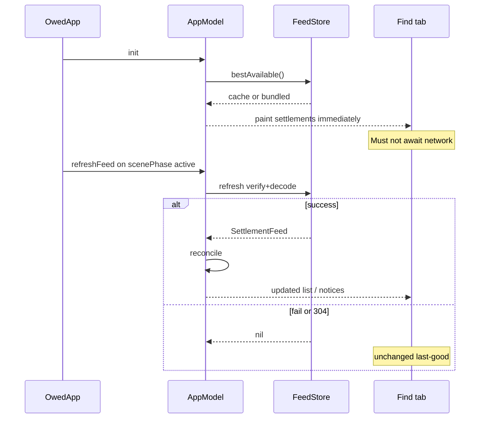
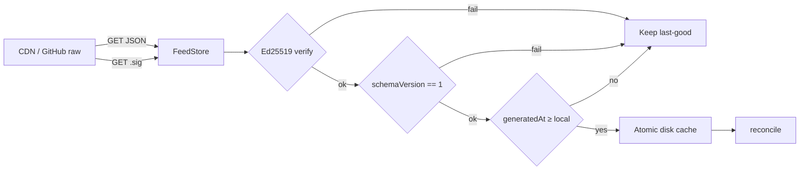
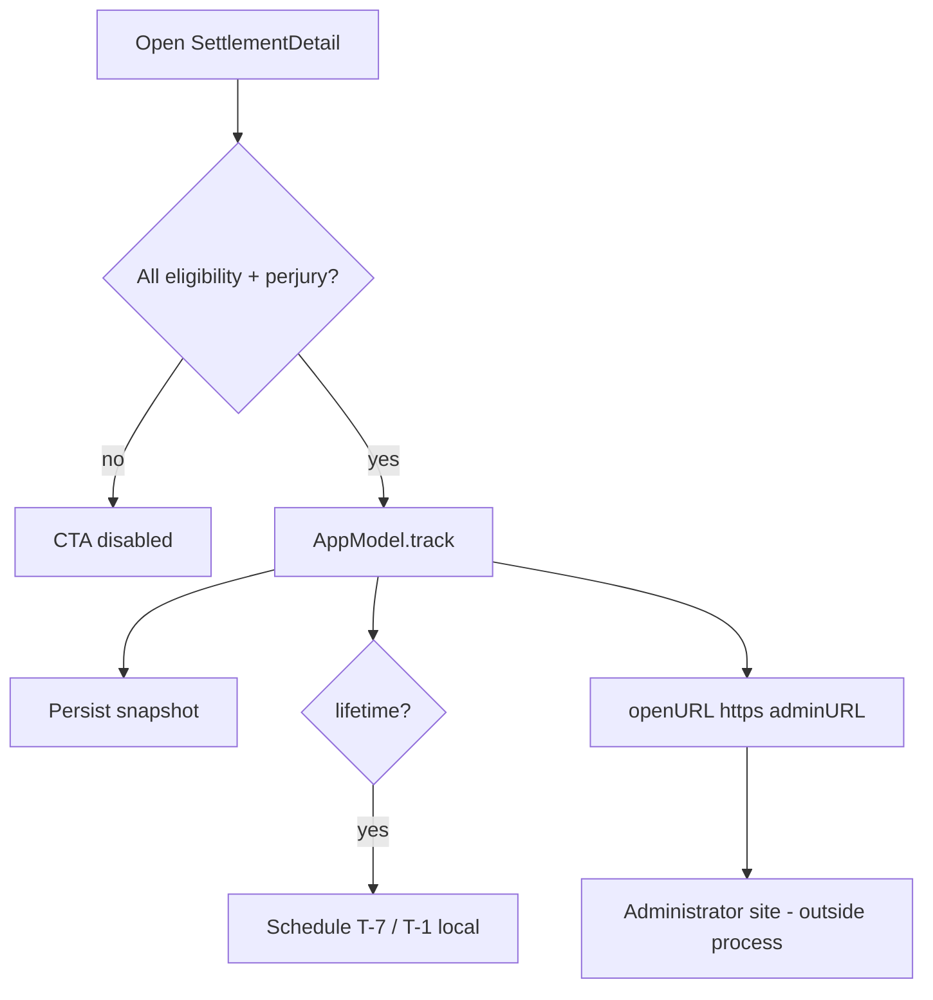
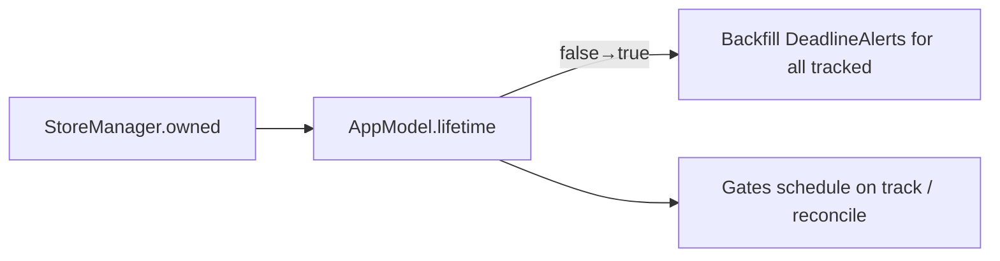

# Owed — Build, Test, and Ship

**Audience:** engineers shipping this binary.  
**Bar:** a wrong deadline or administrator URL is user harm, not a UI bug. Treat feed integrity and attestation as correctness, not polish.

Companion docs: [`../README.md`](../README.md) (index), [`ARCHITECTURE.md`](ARCHITECTURE.md) (full data-flow), [`FEED_OPERATIONS.md`](FEED_OPERATIONS.md) (publish/sign), [`../PIPELINE.md`](../PIPELINE.md) (ingest → human review).

---

## 1. Non-negotiable product invariants

These are printed or implied in the UI. The build must not violate them.

| Invariant | Enforcement in code |
|-----------|---------------------|
| Quiz answers never leave the device | Matched locally; feed GET is identifier-free (`FeedStore` ephemeral session, no cookies) |
| Never file on the user's behalf | Deep-link to `adminURL` only; CTA gated on attestation |
| Administrator links are HTTPS official forms | Decode rejects non-`https` `adminURL` |
| Feed is human-reviewed | `verifiedAt` required; remote bytes Ed25519-verified before cache replace |
| Tracked claims survive feed churn | Local `trackedSnapshots`; feed cannot delete a tracked record |
| Privacy Nutrition Labels stay honest | `PrivacyInfo.xcprivacy`: no tracking, no collected data types |

If a change trades any row for convenience, it needs an explicit product decision — not a drive-by PR.

---

## 2. Environment

| Requirement | Notes |
|-------------|--------|
| macOS | Recent enough for Xcode 16+ |
| Xcode | 16.0+ (project `LastUpgradeCheck = 1600`) |
| iOS deployment | 17.0 (`IPHONEOS_DEPLOYMENT_TARGET`) |
| Simulator | Any iPhone runtime; CI/docs use **iPhone 17 Pro** |
| Optional fonts | `./Scripts/fetch-fonts.sh` — SIL OFL; fallbacks are shippable |

**Identifiers (must stay aligned across binary, StoreKit, Info.plist):**

| Surface | Value |
|---------|--------|
| Bundle ID | `AvaResearchLLC.Owed` |
| Lifetime IAP | `AvaResearchLLC.Owed.lifetime` |
| BGAppRefreshTask | `AvaResearchLLC.Owed.refreshFeed` |
| Feed schema this build reads | `SettlementFeed.supportedSchemaVersion == 1` |

---

## 3. Architecture & runtime data-flow workflows

Deep reference (module map, trust boundaries, anti-patterns): **[`ARCHITECTURE.md`](ARCHITECTURE.md)**.  
What follows is the build-facing workflow every engineer must internalize before changing feed, claims, or StoreKit code.

### 3.1 Thesis

The binary is a **signed-document browser + on-device claim ledger**. Networking exists only to replace a public, human-reviewed JSON artifact. User intent (quiz, tracked ids, logged payouts) never rides on those requests.

### 3.2 Layered runtime

```
OwedApp
  ├─ StoreManager          StoreKit 2 source of truth → mirrors lifetime into AppModel
  ├─ scenePhase / BGTask   → AppModel.refreshFeed()
  └─ RootView (tabs)
        Find / Claims / Alerts  ←── @Environment(AppModel)

AppModel (@MainActor)
  ├─ settlements[]         Find catalog (from FeedStore)
  ├─ tracked + snapshots   Claims ledger (feed cannot delete)
  ├─ profile               MatchKey set (device-local)
  └─ reconcile(_:)         alerts · calendar · notices · Spotlight

FeedStore
  bestAvailable() = disk cache ?? bundled JSON          ← first paint
  refresh()       = GET JSON → GET .sig → verify → decode → cache
```

### 3.3 Workflow A — Cold launch → first paint → refresh



**Build implication:** if Find is empty on a clean install with airplane mode on, the **bundle** is defective — fail the build/smoke, do not “fix refresh.”

### 3.4 Workflow B — Feed bytes on the wire (integrity path)



Order is load-bearing: **signature before decode**. A well-formed malicious JSON must never enter `Settlement` validation.

### 3.5 Workflow C — Reconcile (tracked-claim correctness)

When `refreshFeed` returns a new feed, `reconcile` runs on the main actor:

| Step | Action | Why |
|------|--------|-----|
| 1 | Capture `knownIDs` from current `settlements` | “New to this device” for match alerts |
| 2 | For each **tracked** id in the new feed, write `trackedSnapshots[id]` | Feed updates cannot strand Claims |
| 3 | If `deadline` changed: notice + reschedule T-7/T-1 (lifetime) + calendar best-effort | Stale alerts are the #1 live-data bug |
| 4 | Replace `settlements` + `feedGeneratedAt` | Find tab catalog |
| 5 | Spotlight reindex | Stale closed cases drop from search |
| 6 | Lifetime ∩ profile match ∩ new id → local notification | Makes Alerts copy true pre-push |

**Claims list source:** `trackedSettlements` reads **snapshots first**, then feed fallback — never `settlements.filter(tracked)` alone.

### 3.6 Workflow D — User claim path (attestation → egress)



Owed never POSTs claim forms. HTTPS `adminURL` is enforced at decode time.

### 3.7 Workflow E — Commerce & alerts coupling



Entitlement lives in StoreKit; `lifetime` is a UI/alert mirror. Restore / `Transaction.updates` must be able to clear it on revocation.

### 3.8 Workflow F — Calendar under write-only access

1. `addDeadline` → persist `eventIdentifier` in `calendarEventIDs`.  
2. On deadline move → `updateDeadline(eventIdentifier)`.  
3. If EventKit cannot resolve the id (normal for write-only) → clear calendared; Claims notice offers **Add updated date to Calendar**.  

Do not “fix” this by requesting full calendar read without a product/privacy change.

### 3.9 Data that never leaves the device

| Data | Storage | Network |
|------|---------|---------|
| Match quiz answers | `owed.profile` | None |
| Tracked ids + snapshots | UserDefaults + in-memory | None |
| Logged payouts | `owed.received` | None |
| Feed GET | — | Public file only; no query params / cookies |

### 3.10 Where to change what (review map)

| If you are changing… | Start here | Also read |
|----------------------|------------|-----------|
| Refresh / CDN / signing | `FeedStore`, `FeedSigning` | FEED_OPERATIONS, Workflow B |
| Decode / dates / ids | `Settlement`, `SettlementFeed` | OwedTests decode suite |
| Claims / notices / alerts | `AppModel.reconcile` | Workflow C, ARCHITECTURE §4 |
| Launch / BG | `OwedApp`, `FeedBackgroundRefresh` | Workflow A |
| IAP | `StoreManager`, `PaywallView` | Workflow E |
| Attestation CTA | `SettlementDetailView` | Workflow D |

Full diagrams, state-key inventory, and anti-patterns: **[`ARCHITECTURE.md`](ARCHITECTURE.md)**.

---

## 4. Build matrix — what “green” means

### 4.1 Interactive (Xcode)

1. Open `Owed.xcodeproj`.
2. Signing & Capabilities → select Development Team (bundle id above).
3. Scheme **Owed**, destination an iPhone simulator or device.
4. **⌘B** must succeed with zero errors. Treat new warnings in feed/StoreKit/EventKit paths as defects until triaged.
5. **⌘R** — acceptance smoke (below).
6. **⌘U** — `OwedTests` must be green (below).

StoreKit Configuration File is already on the shared scheme (`Owed.storekit`). Lifetime purchase/restore is testable without App Store Connect.

### 4.2 Headless compile + install

```bash
# From the repository root:
set -euo pipefail
DEST='platform=iOS Simulator,name=iPhone 17 Pro'
DD=/tmp/OwedSimBuild

xcodebuild -project Owed.xcodeproj -scheme Owed \
  -destination "$DEST" -derivedDataPath "$DD" build

xcrun simctl boot "iPhone 17 Pro" 2>/dev/null || true
open -a Simulator
xcrun simctl install booted \
  "$DD/Build/Products/Debug-iphonesimulator/Owed.app"
xcrun simctl launch booted AvaResearchLLC.Owed
```

**Pass criteria:** `** BUILD SUCCEEDED **`, process launches, Find tab shows settlements (never an empty list solely due to network — bundled floor must load).

### 4.3 Automated tests (gate for feed/reconcile changes)

```bash
xcodebuild test -project Owed.xcodeproj -scheme Owed \
  -destination 'platform=iOS Simulator,name=iPhone 17 Pro'
```

| Suite | Contracts under test |
|-------|----------------------|
| `FeedDecodingTests` | Schema gate fails whole; malformed records drop; dup ids keep first; unknown `matchKeys` ignored; `http` admin URL rejected; payout/eligibility/deadline validation; Codable round-trip |
| `ReconciliationTests` | Removed feed rows survive when tracked; deadline diffs → notices; legacy calendared-without-eventID clears; event ids persist; untrack cleans ledger |
| `FeedSigningTests` | Bundled `.sig` verifies; tamper fails; random sig fails |

Tests inject isolated `UserDefaults` suites — do not reintroduce `UserDefaults.standard` coupling in new cases (parallel Swift Testing will flake).

**Pass criteria:** 0 failures. Feed or reconciliation PRs that land without extending these suites are incomplete.

### 4.4 Cursor / XcodeBuildMCP

Project skill `/run-sim` (`.cursor/skills/run-sim/`) builds, launches, and screenshots via XcodeBuildMCP. Use for agent-driven verification; humans still own App Review judgment.

MCP config (`.cursor/mcp.json`) is **machine-local and gitignored** — not part of the product binary.

---

## 5. Manual smoke checklist (every release candidate)

Run after ⌘R on a clean simulator (Device → Erase All Content preferred for RC).

1. **Cold launch / offline floor** — Find shows ≥1 settlement with airplane mode on (bundled JSON).
2. **Feed refresh** — With network, Alerts footer shows a “SETTLEMENT LIST UPDATED …” stamp after foreground; no crash if GitHub/CDN is down (last-good retained).
3. **Quiz privacy** — Complete match quiz; confirm copy still asserts on-device matching; For you filter appears.
4. **Attestation gate** — Open a settlement; CTA disabled until all eligibility boxes + perjury attestation; then track.
5. **Claims + deadline notice** — Track a claim; (dev) publish a deadline change + resign + push; foreground app → notice on My claims; T-7/T-1 reschedule for lifetime users.
6. **Calendar** — Add deadline; on deadline change under write-only access, “Add updated date to Calendar” appears when in-place update is unavailable.
7. **StoreKit** — Purchase lifetime in `.storekit` config; badge → LIFETIME ✓; Restore Purchases path works; Alerts tab “You’re covered”.
8. **Dynamic Type** — Settings → Larger Text; docket cards and icons remain readable (no clipped primary CTA).
9. **Archive** — Product → Archive; confirm `PrivacyInfo.xcprivacy` is in the archive’s app bundle.

---

## 6. Configuration surfaces that ship in the binary

| Artifact | Why it matters |
|----------|----------------|
| `Info.plist` | Calendar usage string; `BGTaskSchedulerPermittedIdentifiers`; `UIBackgroundModes` = `fetch`; font registration |
| `PrivacyInfo.xcprivacy` | Required-reason API declaration — missing → App Store rejection |
| `Owed.storekit` | Local IAP testing only; production product must match `StoreManager.lifetimeID` |
| `FeedStore.remoteURL` | Today: GitHub raw on `main`. Cut over to CDN by changing this constant + publishing JSON+`.sig` as a pair |
| Bundled `SettlementFeed.json` | Offline floor and first-paint; must remain a valid schema v1 snapshot |

---

## 7. Failure modes engineers must recognize

| Symptom | Likely cause | Correct response |
|---------|--------------|------------------|
| Find empty on first launch | Bundled JSON missing/undecodable | Fix bundle membership / decode; never “ship and refresh” |
| Refresh never updates | Missing/invalid `.sig` on remote, or `generatedAt` rewind | See FEED_OPERATIONS; do not weaken verify-to-ship |
| Tests flake on tracked state | Shared `UserDefaults.standard` | Use suite injection like `ReconciliationTests` |
| Lifetime purchase no-ops | Product id mismatch vs App Store Connect / `.storekit` | Align `AvaResearchLLC.Owed.lifetime` |
| BG refresh never runs | Expected — system coalesces; not a substitute for foreground reconcile | Keep foreground refresh; treat BG as best-effort |
| Calendar “update” no-ops | Write-only EventKit — by design | One-tap re-add on Claims notice |

---

## 8. App Store submission packet

**Binary**

- [ ] Team signing; bundle id `AvaResearchLLC.Owed`
- [ ] 1024pt App Icon
- [ ] `PrivacyInfo.xcprivacy` in archive
- [ ] Encryption export: `ITSAppUsesNonExemptEncryption` = false (current)

**Commerce**

- [ ] Non-consumable `AvaResearchLLC.Owed.lifetime` at $5.99 in App Store Connect
- [ ] Paywall shows Restore Purchases

**Review notes (paste-ready posture)**

> Owed helps users find open class-action settlements. Browsing is free. The app never files claims and is not a law firm. Claim links open only court-appointed administrator sites (HTTPS). Starting a claim requires checking eligibility criteria and a perjury attestation. Match-quiz answers are stored and matched only on device; the settlement list is fetched as a public signed file with no user identifiers. The optional lifetime purchase enables local deadline reminders.

**Category:** Finance.

**Do not submit** with example administrator hosts still in the feed if you are representing production data — replace with verified records per PIPELINE.md §4, resign, and push.

---

## 9. Definition of done (engineering)

A change is done when:

1. `xcodebuild build` succeeds for the shared scheme.
2. `xcodebuild test` is green.
3. Smoke checklist items touched by the change were re-run.
4. Feed edits include a new `.sig` (and `generatedAt` bump) — see FEED_OPERATIONS.
5. Privacy copy and attestation behavior are unchanged unless the PR explicitly changes product posture.
6. Architecture / data-flow docs updated if ownership, refresh order, or trust boundaries changed (`ARCHITECTURE.md`, this §3).
7. README / this doc updated if identifiers, schemes, or publish URLs changed.
